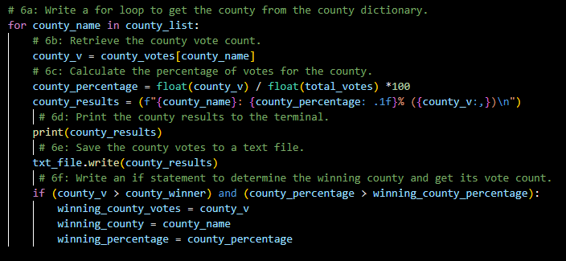

# Election_Analysis

## Project Overview
A Colorado Board of Elections employee has given you the following tasks to complete the election audit of a recent local congressional election. This project will enforce a better understanding of the Python programming language through Visual Studio Code by analyzing election data. To do this, deliver the following:

* Calculate the total number of votes cast.
* Get a complete list of candidates who received votes
* Calculate the total number of votes each candidate received
* Calculate the percentage of votes each candidate won
* Determine the winner of the election based on popular vote.

## Resources
Data Source: election_results.csv
Software: Python 3.7.6; Visual Studio Code 1.68.1

## Results
The analysis of the election show that:
  * There were 369,711 votes cast in the election.
- The candidates were:
  * Charles Casper Stockham
  * Diana DeGette
  * Raymon Anthony Doane
- The candidate results were:
  * Charles Casper Stockham received 23% of the vote and 85,213 votes.
  * Diana DeGette received 73.8% of the vote and 272,892 votes.
  * Raymon Anthony Doane received 3.1% of the vote and 11,606 votes.
  * The winner of the election was:
  * Diana DeGette with 73.8% of the vote and 272,892 votes.

  

## Election Audit Summary
The code for this project was written in a way that allows its user to run an analysis on any election data set, making this a valuable script. The code is easily adjusted in order to analyze different electoral data. This is much like refactoring VBA, but easier. In order to adjust this code for any tabular data set, one simply needs to change the source of the code used when initiating the code. 

Two areas that are easily modified are the candidate and county fields. Each one of these are easily adjusted. Both of these fields pull data directly from the CSV file that is sourced in the beginning. The candidate field can be easily modified for various different data sets. The county is able to be modified to similar data such as cities, states, and countries. 

### Candidate Field

### County Field

Another benefit of using Visual Studio Code and Python programming language is being able to easily commit code to a text file as such:

## Improvements
The election committee may possibly think of adjusting the code in order to gain a wider view of the data being analyzed. The committee may think of implementing an additional conditional to determine the candidate vote percentage by county. This way, similarly to the Presidential election, the committee can identify where each candidate is most popular. This election audit and analysis are capable of handling much more data, much of which would be beneficial when trying to understand the data. 
